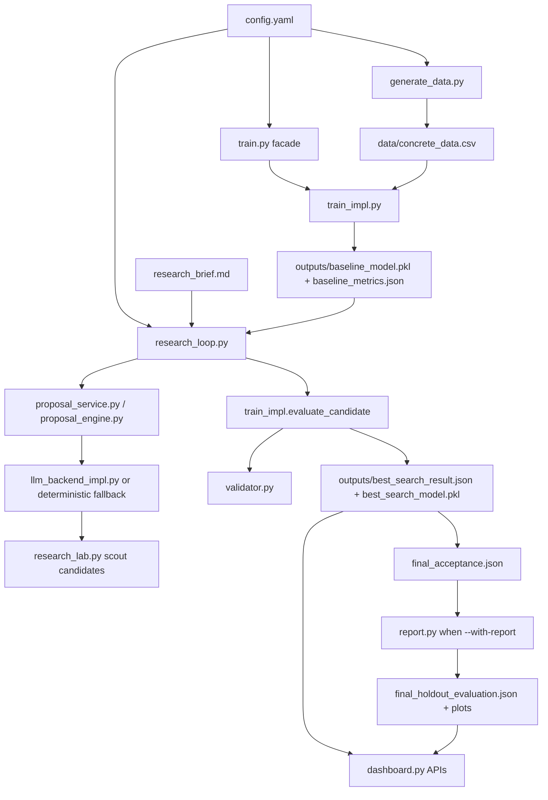

# Graph Index

Generated: 2026-04-22.

## Graph Build

GitNexus indexing completed successfully:

- 2,693 nodes
- 7,967 edges
- 150 clusters
- 230 flows

An AST import scan found no Python parse errors in analyzed source files. The local Python import graph confirms that the repository is built around one main research/runtime spine plus several auxiliary surfaces.

## Import Graph Summary

Top imported local modules:

| Incoming count | Module |
| ---: | --- |
| 16 | `train_impl.py` |
| 14 | `train.py` |
| 13 | `research_protocol.py` |
| 11 | `artifact_contracts.py` |
| 11 | `validator.py` |
| 11 | `mix_design/contracts.py` |
| 11 | `feature_engineering.py` |
| 9 | `hypothesis_archive.py` |
| 9 | `novelty_scorer.py` |
| 8 | `uncertainty.py` |
| 8 | `failure_analyzer.py` |
| 8 | `feature_lab.py` |
| 7 | `research_loop.py` |
| 7 | `llm_backend.py` |

Top local importers:

| Outgoing count | Module |
| ---: | --- |
| 36 | `test_track_b.py` |
| 20 | `research_loop.py` |
| 10 | `train.py` |
| 9 | `search.py` |
| 9 | `mix_design/facade.py` |
| 7 | `proposal_api.py` |
| 7 | `research_loop_helpers.py` |

The unusually high outgoing count from `test_track_b.py` is misleading because configured pytest does not collect it.

## Core Runtime Path

## Execution Flow

1. `generate_data.py` reads `config.yaml`, resolves the data mode, normalizes local/real/synthetic concrete data, applies feature engineering, and writes `data/concrete_data.csv`.
2. `train.py` delegates to `train_impl.main()`.
3. `train_impl.main()` loads config and data, evaluates the configured baseline, applies engineering validation, and writes baseline artifacts.
4. `research_loop.py` loads config, current baseline/current best, `research_brief.md`, experiment memory, knowledge context, proposal services, and validation state.
5. Candidate proposals are produced by LLM/hybrid/deterministic providers, normalized, gated, and selected.
6. `train_impl.evaluate_candidate()` runs model CV/evaluation with validator integration.
7. `loop_artifacts.py` and `artifact_sync.py` write synchronized research results, best search result, model pickle, diversity, logs, run manifests, and acceptance artifacts.
8. If `--with-report` is passed, `research_loop.py` imports `report.py`; `report.py` requires `final_acceptance.json` and writes terminal holdout artifacts and plots.
9. `dashboard.py` reads generated artifacts from `outputs/` and exposes JSON APIs plus HTML.

## UI -> State -> Logic -> Output Flow

| Surface | State read | Logic used | Output/action |
| --- | --- | --- | --- |
| Dashboard `/api/overview` | `outputs/best_search_result.json`, optional `final_holdout_evaluation.json`, deprecated fallback | `dashboard.load_*`, `artifact_contracts.map_deprecated_artifact_payload` | Overview JSON |
| Dashboard `/api/design_generate` | model artifacts, config, request body | `design_tool.MixDesignOptimizer`, `mix_design.facade` | Design JSON written under `outputs/` |
| Dashboard `/api/share_latest` | current overview artifacts | snapshot builder in `dashboard.py` | `shared_snapshots.json`, `share_events.jsonl` |
| CLI `design_tool.py` | `outputs/best_search_model.pkl`, uncertainty artifacts, config | `mix_design` package | `design_*MPa.json`, batch CSV |
| CLI `report.py` | `best_search_result.json`, `final_acceptance.json`, model, data | holdout/report/uncertainty logic | `final_holdout_evaluation.json`, plots |

## Config Dependencies

| Config section | Primary consumers |
| --- | --- |
| `paths` | `generate_data.py`, `train_impl.py`, `research_loop.py`, `dashboard.py` indirectly |
| `data` | `generate_data.py`, `train_impl.py` |
| `task` | `train_impl.py`, `feature_engineering.py`, `validator.py` |
| `validator` | `validator.py`, `design_tool.py`, `mix_design.facade` |
| `engineering` | `feature_engineering.py`, `uncertainty.py`, `mix_design`, `train_impl.py` |
| `experiment` | `train_impl.py`, `research_loop.py` |
| `search` | `search.py`, compatibility translation, model search definitions |
| `research` | `research_loop.py`, `research_loop_helpers.py`, `loop_candidate_selection.py` |
| `llm` | `llm_backend_impl.py`, `proposal_engine_impl.py`, `proposal_service.py`, smoke tests |
| `benchmark` | `benchmark.py` |

## Test -> Code Mapping

| Test file(s) | Code under test | Notes |
| --- | --- | --- |
| `tests/test_golden_run.py` | `research_loop.py`, `train_impl.py` | Most important end-to-end fixture; deterministic, LLM disabled, reports disabled. |
| `tests/test_artifact_contracts.py`, `tests/test_artifact_lineage.py` | `artifact_contracts.py`, `train.py` | Contract and lineage checks. |
| `tests/test_research_loop.py`, `tests/test_research_protocol.py` | `research_loop.py`, `research_protocol.py`, proposal selection | Unit-level loop/protocol behavior. |
| `tests/test_train.py`, `tests/test_integrity_checks.py`, `tests/test_holdout_integrity.py` | `train.py`, `integrity_checks.py`, `benchmark.py` | Training and holdout guard checks. |
| `tests/test_dashboard.py` | `dashboard.py` | API/payload/dashboard behavior. |
| `tests/test_design_*`, `tests/test_objective_engine.py` | `design_tool.py`, `mix_design/*` | Strong coverage for inverse design refactor. |
| `tests/test_llm_backend.py`, `tests/test_proposal_*`, `tests/test_model_routing.py` | LLM/proposal stack | Mostly mocked; not proof that real Ollama/OpenAI service is available. |
| `test_track_b.py` | Track B modules | Not collected by configured pytest. |

## Docs -> Code Mapping

| Doc | Alignment |
| --- | --- |
| `README.md` | Mostly aligned with canonical runtime, but still overstates current artifact completeness because current terminal holdout artifact is absent. |
| `ARCHITECTURE_V2.md` | Good canonical runtime contract. Conflicts with current artifacts where deprecated `final_metrics.json` is still present and referenced by acceptance. |
| `PROJECT_INDEX.md` | Stale. Current best-model claim does not match `outputs/best_search_result.json`; line counts are stale. |
| `docs/autoresearch_workflow.md` | Relevant conceptual workflow. Needs check against current LLM and artifact behavior before treating as source. |
| `docs/artifact-contract-migration.md` | Useful migration context. Current repo still contains legacy artifact fallback paths. |
| `docs/superpowers/specs/2026-03-13-llm-proposal-backend-design.md` | Stale: says `final_metrics.json` remains source of truth. |
| `docs/superpowers/specs/2026-03-27-mix-design-subsystem-design.md` | Largely implemented: `mix_design/` canonical package exists and `design_tool.py` is a deprecated adapter. |
| `wiki/**` | Untracked generated review material; can help humans but should not be canonical until curated. |

## Feature Flow Mapping

| Feature | Flow | Reality |
| --- | --- | --- |
| Baseline training | `train.py` -> `train_impl.main()` -> baseline artifacts | Implemented. |
| Governed research loop | `research_loop.py` -> proposal provider -> candidate evaluation -> artifact sync | Implemented and tested with deterministic golden fixture. |
| LLM proposals | `proposal_service.py` -> `proposal_engine_impl.py` -> `llm_backend_impl.py` | Implemented, but real service availability is external and not proven by CI. |
| Deterministic fallback | `proposal_service.py` -> `research_lab.scout_experiments` | Implemented. |
| Final holdout report | `report.py` gated by `final_acceptance.json` | Implemented but current output is missing and current acceptance is rejected. |
| Dashboard | `dashboard.py` reads `outputs/` | Implemented but depends on generated artifacts and has fallback/deprecated reads. |
| Inverse design | `design_tool.py` -> `mix_design.facade` | Implemented with deprecated adapter still public. |
| Academic benchmark | `benchmark.py` | Implemented auxiliary path. |
| Field tracker | `field_tracker.py` | CLI exists, weakly connected to core. |

## Isolated Modules and Orphans

| File | Evidence | Assessment |
| --- | --- | --- |
| `loop_execution.py` | No incoming local imports in AST graph. | Candidate for deletion or reintegration after verification. |
| `field_tracker.py` | CLI only, no incoming local imports. | Keep only if field validation workflow is real. |
| `autocivil_autosearch_session.py` | CLI/session wrapper only. | Peripheral compatibility wrapper. |
| `test_track_b.py` | Root-level test excluded by `pytest.ini`. | Misleading; archive or move under `tests/` if still relevant. |
| `config_track_b_additions.yaml` | No canonical import found. | Verify with Track B history; likely stale. |
| `raw/` | Empty, untracked. | Delete unless planned source collection is imminent. |

## Circular Dependency Risk

Confirmed fragile import pattern:

- `research_loop.py` imports `search.py`
- `search.py` lazily proxies back to `research_loop.py`

This is mitigated by lazy import/proxy code in `search.py`, but it is still a boundary smell. The deprecated wrapper remains large and easy to accidentally treat as a runtime owner.

Other high-friction boundaries:

- `proposal_engine.py` -> `proposal_api.py` -> `proposal_engine_impl.py` plus `proposal_service.py` creates multiple proposal entry surfaces.
- `design_tool.py` remains a public class and CLI even though `mix_design/` is canonical.
- `artifact_contracts.py`, `research_protocol.py`, `report.py`, and `dashboard.py` all know about legacy artifact mapping; this spreads migration state.

## Choke Points

| Choke point | Risk |
| --- | --- |
| `train_impl.py` | Very large core file; many systems depend on its APIs and artifact helpers. |
| `research_loop.py` | Orchestrates too many concerns: proposal setup, candidate loop, acceptance, artifact validation, optional report, smoke commands. |
| `dashboard.py` | 3,151-line monolith containing IO, auth, API handlers, HTML, CSS, and JS. |
| `artifact_contracts.py` | Central schema enforcement plus deprecated mapping; mistakes affect report, dashboard, benchmark, loop. |
| `config.yaml` | Single very large config controls multiple modes; stale or contradictory sections can alter runtime silently. |

## Fragile Boundaries

| Boundary | Fragility |
| --- | --- |
| Search selection vs final holdout | Code intends separation, but validation can pass without final holdout existing. |
| Canonical vs deprecated artifacts | `final_metrics.json` still exists and acceptance currently points at it. |
| LLM vs deterministic proposal | Good fallback exists, but config defaults to Ollama with long timeout; full runtime can block on local/cloud service. |
| Tests vs full runtime | Golden run disables reports and LLM, so it proves the deterministic loop slice, not full official `--with-report` behavior. |
| Dashboard vs artifacts | Dashboard can display missing-artifact warnings, but deployment docs require generated artifacts to be committed or regenerated. |

